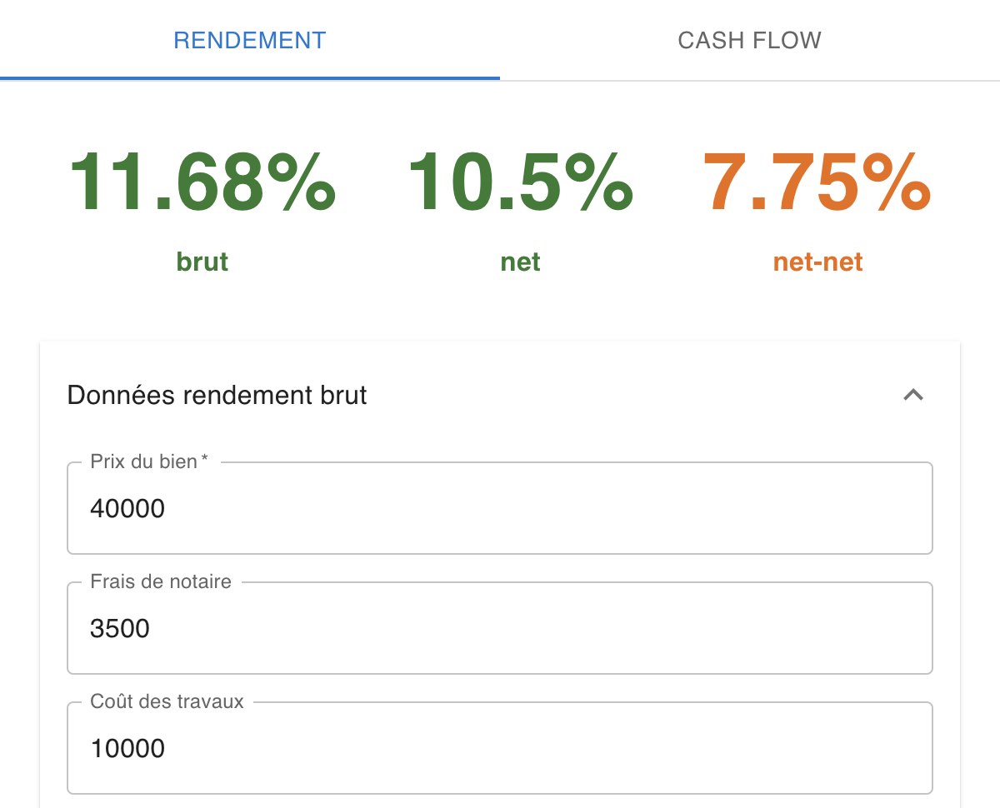
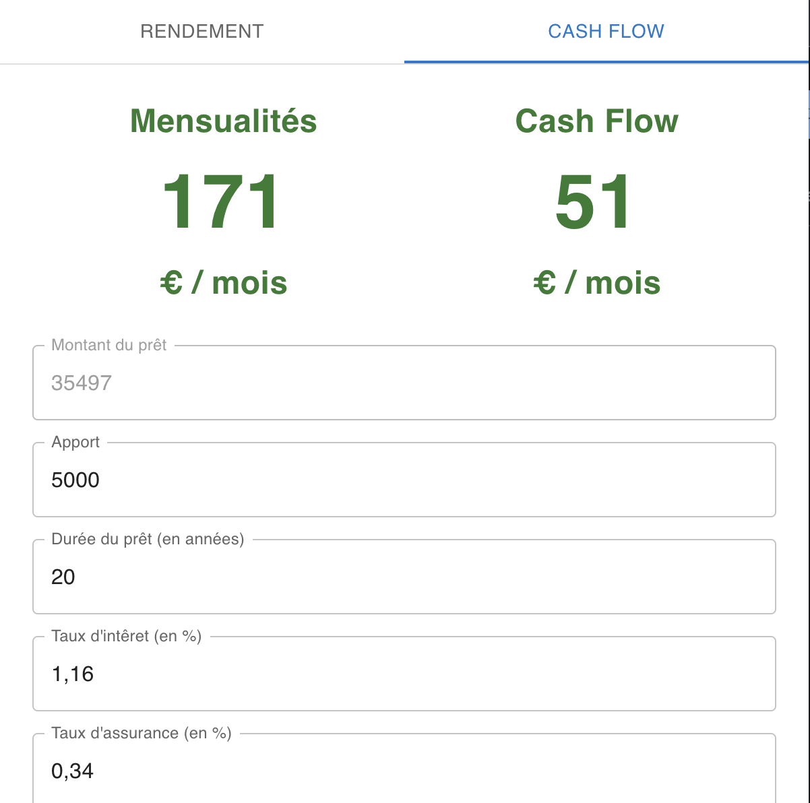

# Renta Check

[Download the extension](https://chrome.google.com/webstore/detail/renta-check/fhddailnnhgefondnkjnkghfnmhlbpic?hl=fr)

## Stack

- React
- Typescript

## Purpose

Renta Check is a browser extension allowing you to quickly calculate financial yield for a rental property investment.

The extension is divided in two part.

### Yield

Get quickly the 3 main indicator's of you investment: **raw**, **net** and **net-net yield**.

### Cash Flow

Estimate the cash flow of your investment

